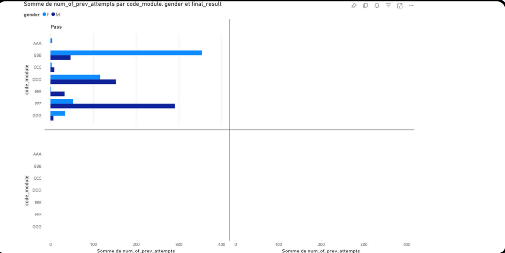
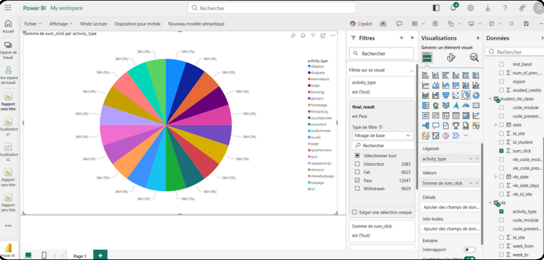
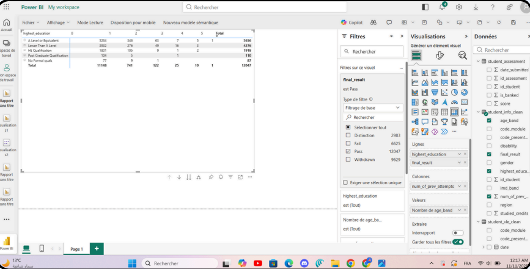

# BI Project: Student Performance & Engagement Analysis

## Overview
This BI (Business Intelligence) project is a case study focused on analyzing student **performance** and **engagement** in an online learning environment. Using data from assessments, student interactions, and online classroom activities, the project provides insights into the factors influencing academic success and identifies high-potential learners.

## Objectives
- Analyze academic performance across modules and presentations.
- Measure student engagement in the Virtual Learning Environment (VLE).
- Explore the influence of demographics and 21st-century skills on success.
- Identify at-risk students and courses prone to dropout.
- Build a **data-driven framework** for monitoring and decision-making.

## Project Structure
The project is organized into **5 notebooks**, each containing all relevant tables and results:

1. **01_explore_tables** – Data exploration and overview  
2. **02_clean_transform** – Data cleaning and transformation  
3. **03_analysis_kpis** – KPI calculations and analysis  
4. **04_data_warehouse_design** – Fact and dimension tables design  
5. **05_etl_pipeline** – ETL implementation and processed results  

## Data Sources
- `courses.csv` – Module and presentation information  
- `assessments.csv` – Assessment details  
- `vle.csv` – Virtual Learning Environment resources  
- `studentInfo.csv` – Student demographics and results  
- `studentRegistration.csv` – Registration and withdrawal info  
- `studentAssessment.csv` – Student assessment results  
- `studentVle.csv` – Student interactions with VLE materials  
- `Online classroom Data.csv` – Collaborative participation and skills  
### Power BI Visualizations

#### 1. Student Performance by Module

#### 2. Répartition de l’Engagement

#### 3. Impact de l’Éducation & Tentatives

#### 4. Global Engagement Overview

## Tools & Technologies
- Python & Pandas for data processing  
- PySpark & Databricks for ETL and data warehouse design  
- Power BI for dashboards and visualization  

